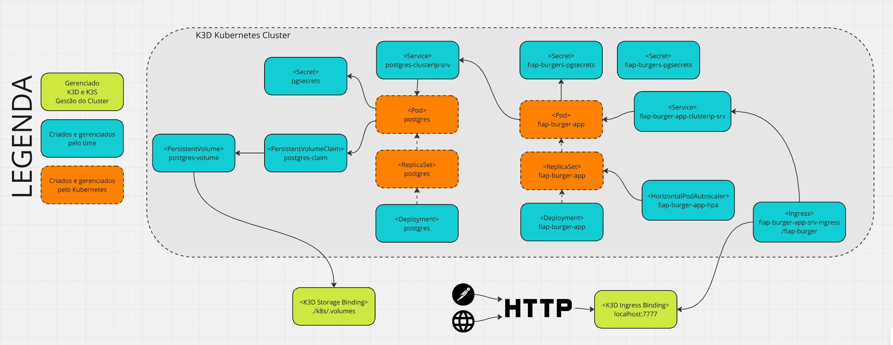
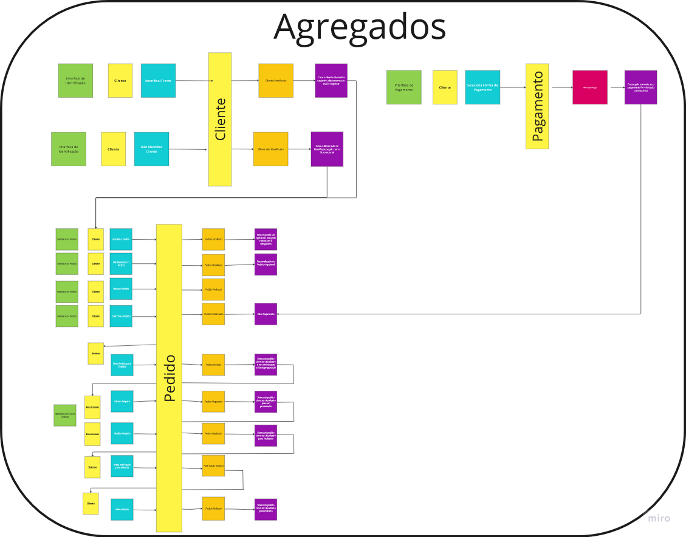

# Tech Challenge FIAP Project

Este projeto foi desenvolvido durante a `Fase II`, do curso de `Arquitetura de Software` da FIAP, como requisito para avaliação.

## Integrantes do Grupo 7SOAT-31:

- Julio Augusto Silva (RM355432)
- Lucas Henrique de Oliveira Silva (RM354904)
- Getúlio Magela Silva (RM355427)
- Lucas Rego Lima (RM356101)
- Lilian Rosario de Jesus (RM355928)

## Arquitetura K8S

## Event Storming :[Ver no Miro 👁️](https://miro.com/app/board/uXjVKYNMy0E=/):

## Instruções para Implantação do Projeto com K8S + K3D

O projeto está preparado para implantação utilizando um cluster kubernetes.

- [Criar Cluster Kubernetes com K3D e Implantar a Aplicação](./k8s/README.md)

## OpenAPI - Swagger

- O arquivo está disponibilizado em `./docs/swagger/openapi.yaml` e pode ser importado no [editor da OpenAPI](https://editor.swagger.io).
- O Swagger também está disponível na aplicação. Após a implantação com sucesso da aplicação acessar a [URL](http://localhost:7777/fiap-burger/swagger-ui/index.html).

## Postman

- Collection e Environments disponibilizados direto no código fonte `./docs/postman`
- [Collection e Environments Via Postman](https://www.postman.com/gm50x/workspace/7soat31/collection/10261834-c3a1434e-4636-4150-b6ac-531acf1182da?action=share&creator=10261834&active-environment=10261834-11ead16b-1dc1-415d-a87f-d0d55e12415c)

## Problema

Há uma lanchonete de bairro que está expandindo devido seu grande sucesso. Porém, com a expansão e sem um sistema de controle de pedidos, o atendimento aos clientes pode ser caótico e confuso. Por exemplo, imagine que um cliente faça um pedido complexo, como um hambúrguer personalizado com ingredientes específicos, acompanhado de batatas fritas e uma bebida. O atendente pode anotar o pedido em um papel e entregá-lo à cozinha, mas não há garantia de que o pedido será preparado corretamente.

Sem um sistema de controle de pedidos, pode haver confusão entre os atendentes e a cozinha, resultando em atrasos na preparação e entrega dos pedidos. Os pedidos podem ser perdidos, mal interpretados ou esquecidos, levando à insatisfação dos clientes e a perda de negócios.

Em resumo, um sistema de controle de pedidos é essencial para garantir que a lanchonete possa atender os clientes de maneira eficiente, gerenciando seus pedidos e estoques de forma adequada. Sem ele, expandir a lanchonete pode acabar não dando certo, resultando em clientes insatisfeitos e impactando os negócios de forma negativa.

## Proposta

Para solucionar o problema, a lanchonete irá investir em um sistema de autoatendimento de fast food, que é composto por uma série de dispositivos e interfaces que permitem aos clientes selecionar e fazer pedidos sem precisar interagir com um atendente.

Com o objetivo de aprimorar a experiência do cliente e assegurar uma gestão eficiente dos pedidos, desenvolvemos um sistema de controle de pedidos. Sua arquitetura centraliza-se em um aplicativo de autoatendimento intuitivo, capacitando os clientes a personalizarem seus pedidos de forma ágil e simples, selecionando entre uma variedade de lanches, acompanhamentos, bebidas e sobremesas.

Inicialmente, o sistema integrará apenas com a opção de pagamento via QR Code do Mercado Pago.
