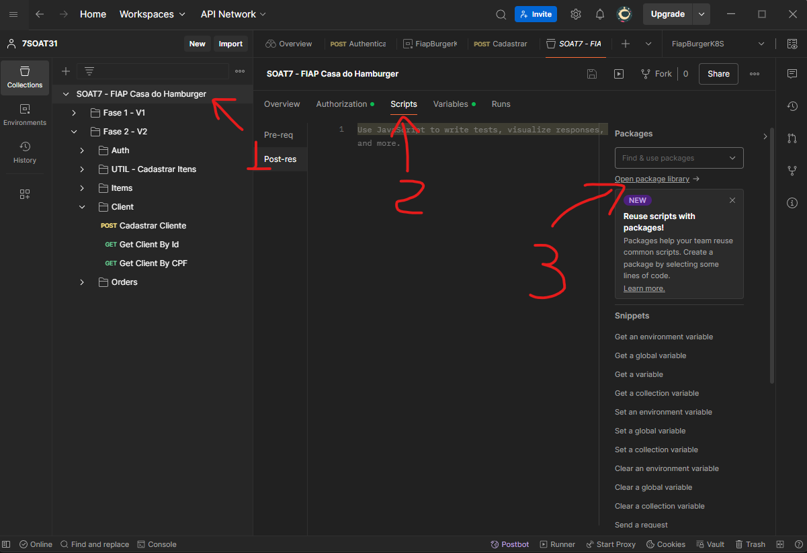
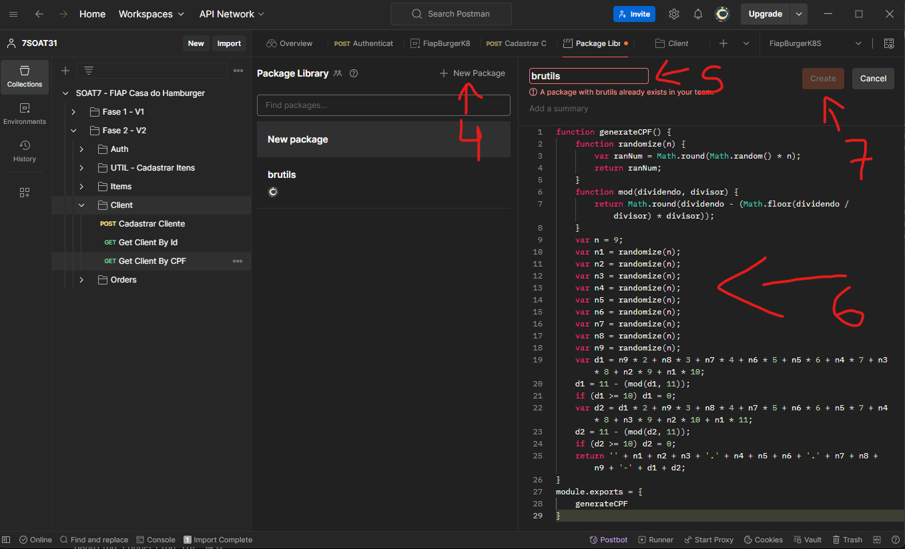

# Postman

Esta collection está configurara com uma library interna no postman. Antes de executar os endpoints é necessário criar uma library com o nome `brutils` seguindos as instruções abaixo:

## Configurando uma Package Library no Postman:

1. Clicar na collection
2. Clicar em scripts na guia central
3. Clicar em `Open package library` no menu da direita
   - 
4. Clicar em `New Package` na parte central
5. Inserir o nome `brutils`
   - É importante que o nome seja exatamente igual pois este pacote será referenciado em scripts
6. Colar o código do arquivo `brutils.js` na caixa de texto
7. Clicar em `Create`
   - 

[Voltar ao Início](../../README.md)
